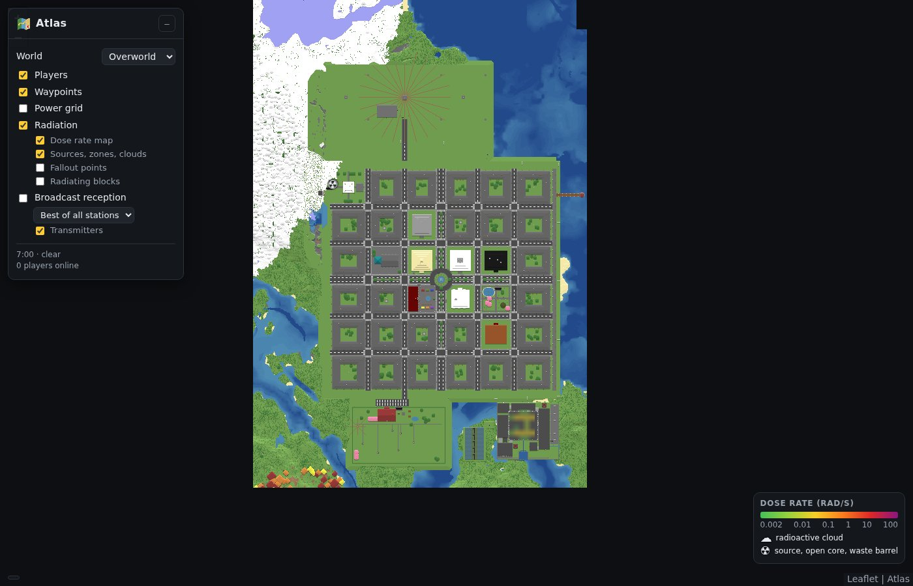
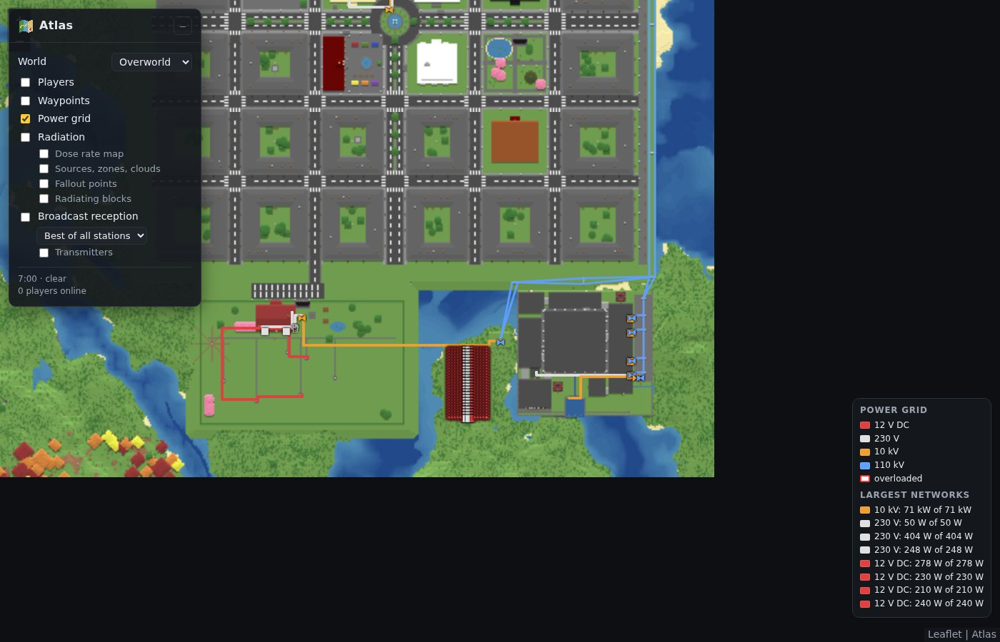
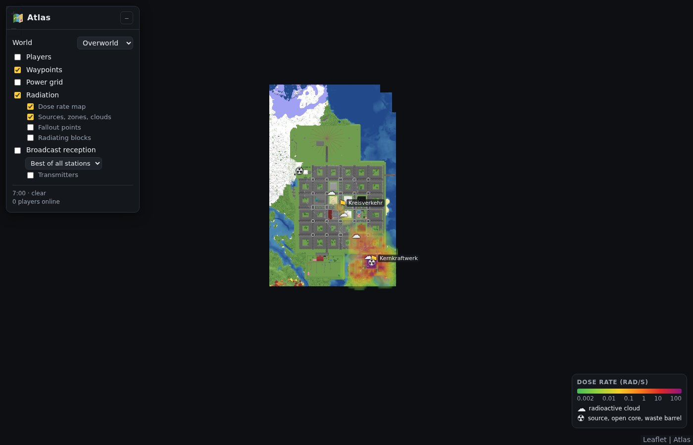
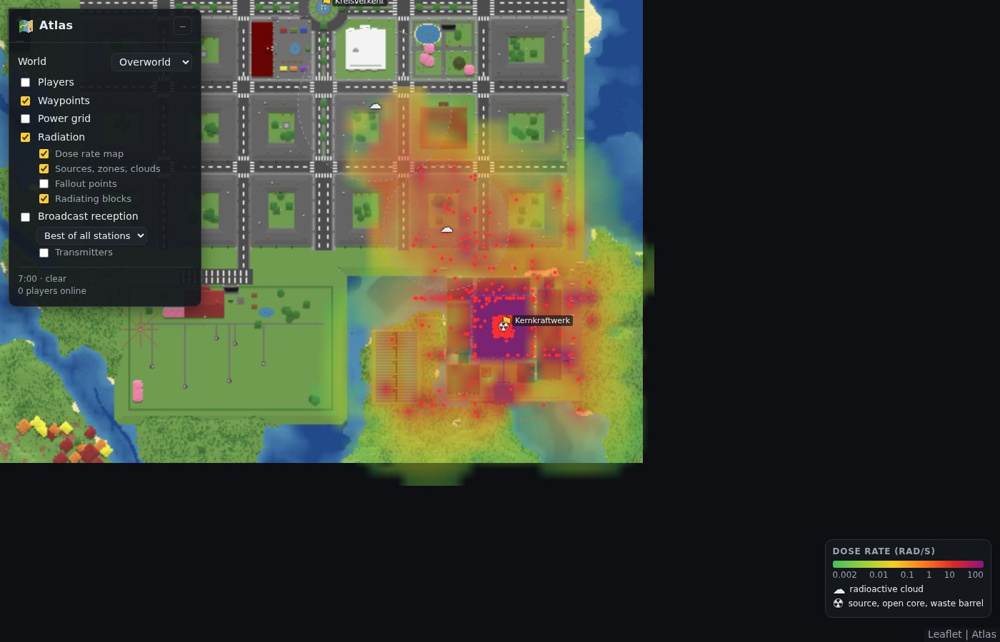
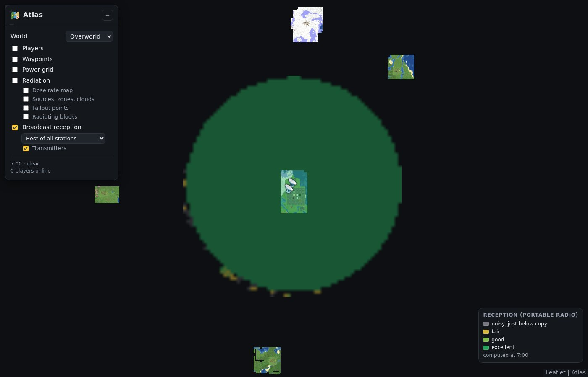

# Atlas

A live web map of your **Minecraft 26.3** (Fabric) world, like Dynmap: the whole world rendered from above, in a
browser, with layers for **waypoints**, **players**, **power grids** (Gridworks), **radiation** (Radiation and
Fission, with drifting clouds and fallout) and **broadcast reception** (Ham Radio).

Online handbook: https://mchamradio.antwire.net/handbook/atlas/
Source code: [github.com/Lamisator/mc_atlas](https://github.com/Lamisator/mc_atlas)



## Installing

Atlas runs on the **server** only: players need nothing installed and can play with or without it.

1. Put `atlas-1.0.1.jar` into the server's `mods` folder (Fabric loader 0.19.5 or newer, Fabric API).
2. Start the server. The first start renders every saved chunk (the DARC Funkstadt map takes about ten seconds).
3. Open `http://<your server>:8123/` in a browser. On a server at home, open TCP port 8123 in the firewall or router.

In singleplayer it works too (the map is on `http://localhost:8123/` while the world is open).

Gridworks, Radiation, Ham Radio and Fission are optional: each layer appears when its mod is installed.

## The map

- **Rendering**: every column shows the colour of its highest block, like a Minecraft map, but one pixel per block,
  with the land shaded by its slope and water darker the deeper it is. Seven zoom levels, from one block per pixel
  out to 64 blocks per pixel; zooming in further enlarges the blocks.
- **Full render** (first start, or `/atlas render`): reads the chunks straight from the saved region files on a
  background thread. Nothing is loaded into the world and nothing is generated: chunks whose generation was never
  finished (the ragged edge of a map) are left out.
- **Live**: chunks are drawn again when they load and when they unload, and every 20 seconds the chunks around each
  player are looked at again, so building shows up within half a minute. Only tiles that actually change are written.
- The **World** box switches between Overworld, Nether (the caverns below the roof) and End.
- The view is kept in the address (`#minecraft_overworld/x/z/zoom`): copy it to share a place. `?layers=grid,radiation`
  in front of the `#` opens the map with exactly these layers on.

## Layers

### Players and waypoints

Players are shown with their name and the direction they look (every two seconds). Spectators and players in
`hiddenPlayers` are not. Waypoints are named places with a flag; click one to zoom in.

| Command | |
|---|---|
| `/atlas waypoint add <name>` | A waypoint where you stand |
| `/atlas waypoint remove <name>` | |
| `/atlas waypoint list` | Click one to get a teleport command |

### Power grid (Gridworks)

Every cable as a dot and every overhead line as a line, coloured by voltage: **12 V DC** red, **230 V** white,
**10 kV** orange, **110 kV** blue. A cable carrying more than 80 % of its rating gets an orange ring, an overloaded one
a red ring. Machines, transformers, solar panels, batteries, meters and breakers (open or closed) are marked. Hover
for the load and current. The legend lists the largest networks with the power delivered of what is wanted - a
network that cannot supply everything shows the share it does.



### Radiation (Radiation, Fission)

- **Dose rate map**: the radiation a Geiger counter would read 1.5 m above the ground, measured on an 8-block grid
  around everything that radiates, from 0.002 rad/s (green) to over 100 rad/s (purple). Shielding counts: the
  inside of a concrete hall can read hundreds, the street outside nothing. Measured again every 30 seconds.
- **Sources, zones, clouds**: radiation zones (dashed boxes), point sources, Fission's open reactor cores and
  **radioactive clouds** (☁, with their size) as they drift with the wind, and nuclear waste barrels.
- **Fallout points**: where clouds left fallout (hidden by default, there can be many).
- **Radiating blocks**: corium, debris, fuel fragments, spent fuel - every block the Radiation mod knows radiates.

| A reactor accident seen from the city | Close up: dose rates, debris, clouds drifting away |
|---|---|
|  |  |

### Broadcast reception (Ham Radio)

Every broadcast transmitter and studio on air (📡), and for each how well a **portable radio** (rubber duck antenna,
1.5 m above the ground) would receive it, computed with Ham Radio's own antenna and propagation model - ground wave,
terrain, and the sky wave at the time of the computation:

| Colour | Reception |
|---|---|
| grey | noisy: just below what can be copied |
| yellow | fair (up to 10 dB above the minimum for the mode) |
| light green | good (10-20 dB above) |
| green | excellent (20 dB and more) |

Choose one station or **Best of all stations**. The coverage is computed up to 2048 blocks from each transmitter
(dashed circle) on a 64-block grid, coarse to fine: a first rough map after a minute, the full one after a few
minutes on the first run (the propagation model has to learn the terrain), seconds later on. It is computed again every
ten minutes. Transmitters are found in the saved chunks, so this works while nobody is near them; they are assumed to
be powered as configured.



## Commands

| Command | |
|---|---|
| `/atlas` | The map's address, the state of rendering and of the coverage computation |
| `/atlas waypoint add\|remove\|list` | See above |
| `/atlas render` | Operators: render all saved chunks again (after changing the world outside the game) |
| `/atlas render here <radius>` | Operators: redraw the loaded chunks around you now |
| `/atlas refresh` | Operators: measure dose rates and broadcast coverage again now |

## Configuration

`config/atlas.json`:

| Setting | Default | |
|---|---|---|
| `bind`, `port` | `0.0.0.0`, 8123 | Where the web map listens; `127.0.0.1` keeps it to the server itself (e.g. behind a reverse proxy) |
| `title` | Atlas | Title of the page |
| `dimensions` | overworld, nether, end | Dimensions that are mapped |
| `fullRenderOnStart` | true | Render all saved chunks on the first start (when there are no tiles yet) |
| `renderBudgetMs` | 8 | Milliseconds per tick for drawing loaded chunks |
| `liveRadiusChunks`, `liveIntervalSeconds` | 6, 20 | Chunks around players that are redrawn, and how often |
| `showPlayers`, `hiddenPlayers` | true, [] | |
| `radiationSpacing`, `radiationIntervalSeconds` | 8, 30 | Dose rate grid |
| `coverageSpacing`, `coverageRange`, `coverageIntervalSeconds` | 64, 2048, 600 | Broadcast coverage grid |

Tiles, waypoints and the list of transmitters are kept in `<world>/atlas/`. Deleting `atlas/tiles` renders the map anew
at the next start.

## Good to know

- **No login**: the map is read-only - nothing a visitor does changes the world - but anyone who can reach the port
  sees it, players' positions included. Set `showPlayers` to false or `bind` to `127.0.0.1` behind a password-protected
  proxy if that matters.
- **An empty server pauses** (`pause-when-empty-seconds` in `server.properties`, 60 s by default): while nobody is
  online, the map stays as it was and is still served; layers continue when someone joins. Set it to 0 to keep them
  running.
- Work is spread over ticks (a few milliseconds each) and a background thread, so the server keeps its 20 ticks per
  second; the first broadcast coverage costs the most (about a minute and a half of server time spread over five
  minutes for the two Funkstadt transmitters).
- Leaflet (BSD-2-Clause) is bundled, so the map also works without internet access.

## Changes

- **1.0.1**: the page opens on the Overworld (1.0.0 could start in the End).

## Building from source

```
./gradlew build                 # build/libs/atlas-1.0.1.jar
./gradlew runServer -PmapMods=<other mods' jars, comma separated>
```

`libs/` holds the Gridworks, Radiation and Ham Radio jars it compiles against (all optional at run time). The web page
is in `src/main/resources/web/`.

## License

MIT
